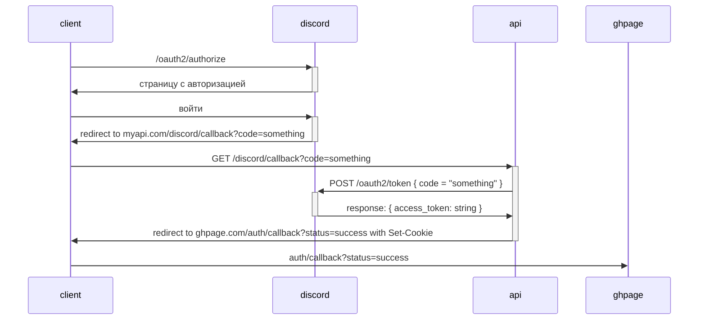

# Авторизация

## Диаграмма



## Client Callback

`/GET /#/auth/callback?status={status}&reason={reason}`

`status` может быть:

* `success`
  В этом случае `reason` не нужен
* `failed`
  В этом случае нужно указать `reason` в типе `string`. Формат записи произвольный. Все равно неизвестно, что в таких случаях делать, поэтому пользователя заставляем повторно проходить авторизацию через кнопошку.

## API Callback

`GET /api/discord/callback?code={discord_code}`

Запрос возвращает 302 status code с пустым телом в любом случае.

В случае удачи в ответе содержатся такие заголовки:

```bash
Location: $CLIENT_CALLBACK_ENDPOINT?status=success
Set-Cookie: laravel_session=23434sdfsdgery; expires=Sat, 18 May 2024 06:06:11 GMT; Max-Age=7200; path=/; httponly; samesite=lax
```

В случае неудачи — такие:

```bash
Location: $CLIENT_CALLBACK_ENDPOINT?status=failed&reason=$ERROR_MESSAGE
```

* `CLIENT_CALLBACK_ENDPOINT` выглядит примерно так: `http://localhost:5173/#/auth/callback` (в случае локального запуска через Vite)
* В `ERROR_MESSAGE` записывается, что пошло не так во время выполнения запроса. Формат произвольный.

На языке [OpenAPI](https://www.openapis.org/) это выглядит так:

```yml
/api/discord/callback:
  parameters:
    - in: query
      name: code
      schema:
        type: string
      required: true
  get:
    responses:
      "302":
        description: Found
        headers:
          Location:
            schema:
              type: string
              example: http://localhost:5173/#/auth/callback?status=success
            examples:
              success:
                value: http://localhost:5173/#/auth/callback?status=success
              failed:
                value: http://localhost:5173/#/auth/callback?status=failed&reason=Code_error
          Set-Cookie:
            schema:
              type: string
              example: laravel_session=23434sdfsdgery; expires=Sat, 18 May 2024 06:06:11 GMT; Max-Age=7200; path=/; httponly; samesite=lax
            examples:
              success:
                value: laravel_session=23434sdfsdgery; expires=Sat, 18 May 2024 06:06:11 GMT; Max-Age=7200; path=/; httponly; samesite=lax
              failed:
                value:
```
