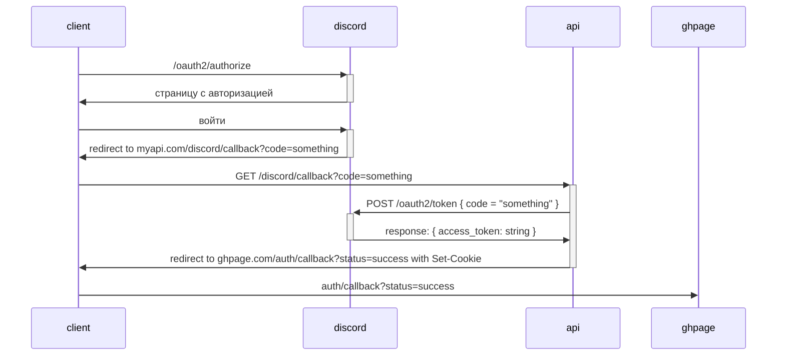

# Авторизация

## Диаграмма



## Client Callback

`/GET /#/auth/callback?code={discord_auth_code}`

Клиент загружается и переправляет `discord_auth_code` на [сервер](#api-callback).

## API Callback

`GET /api/discord/callback?code=$DISCORD_AUTH_CODE`

* results
  * `200` в случае успеха
    * content
      * `text/plain`
      * `$AUTH_TOKEN`
  А в теле оставил только один голый `$AUTH_TOKEN`.

Если так подумать, ошибки должны делиться на две категории: критические

Т.е. ответ выглядит так:

```bash
Content-Type: text/plain

$AUTH_TOKEN
```

В случае неудачи достаточно возвращать `401 Unauthorized` с каким-то телом, но я до сих пор не знаю, какой нужен для этого формат.

В каждый запрос (который требует авторизации) клиент добавляет заголовок `Authorization: Bearer $AUTH_TOKEN`, а север его извлекает, идентифицирует по нему пользователя и отдает нужные данные.

К примеру, на запрос:

```text
GET /api/discord/get-user-data
Authorization: Bearer $AUTH_TOKEN
```

Сервер возвращает:

```json
Content-Type: application/json

{"id":42,"nickname":"foobar"}
```
