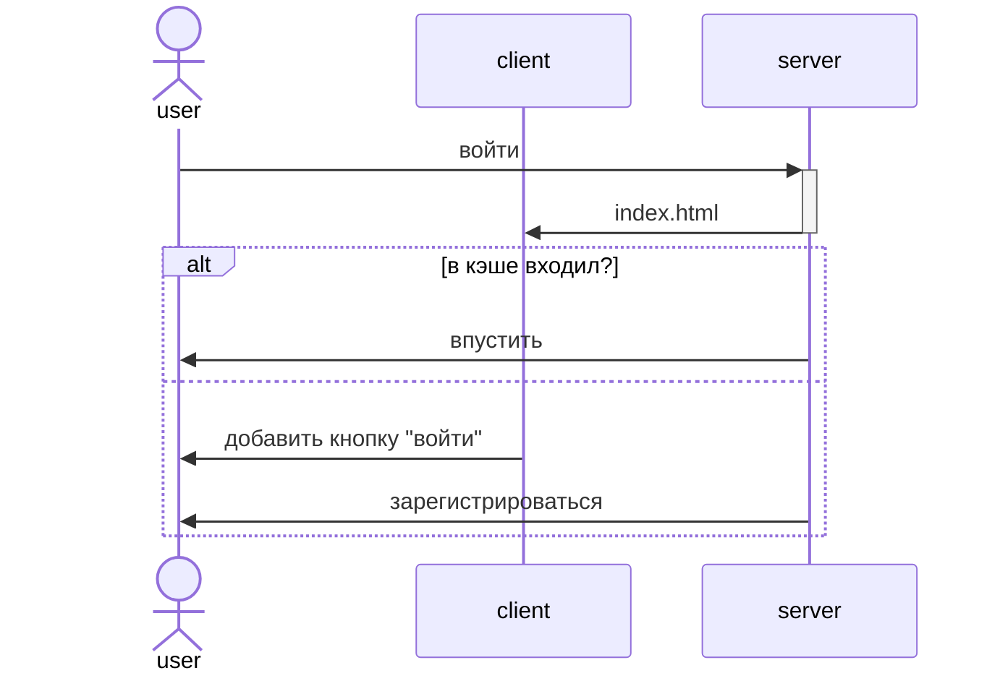
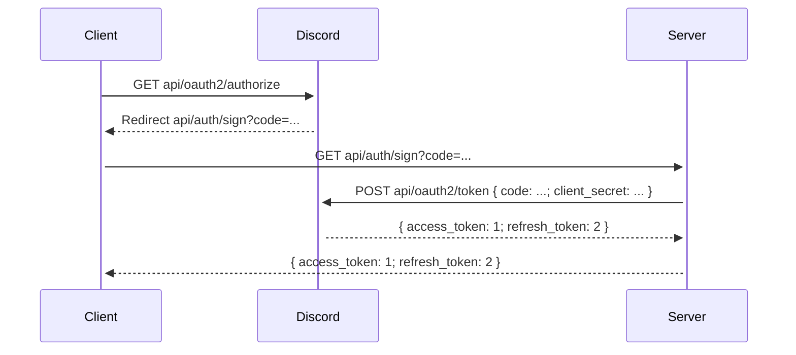

# Client

* Пользователь заходит на сайт, где ему объясняют, зачем этот сайт предназначен, и предлагают войти через [Discord OAuth2](https://discord.com/developers/docs/topics/oauth2)
* Пользователь нажимает войти, и его перекидывает на [авторизацию Discord'а](https://discord.com/oauth2/authorize)
* Пользователь соглашается, и Discord перекидывает его обратно на сайт, где ему показывают две гифки, одну из которых нужно выбрать
* Пользователь выбирает гифку, и программа дает ему следующую пару гифок
* Так продолжается до тех пор, пока не закончится сравнение двух гифок. После этого пользователю показывается список гифок от самой лучшей до худшей и кнопка "Отправить результат"

