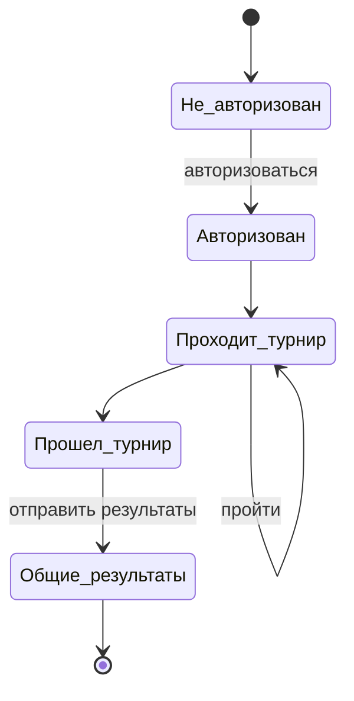
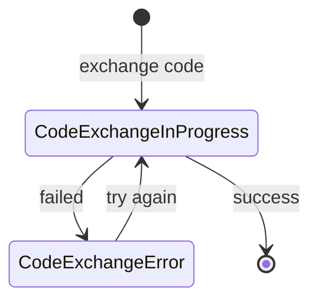
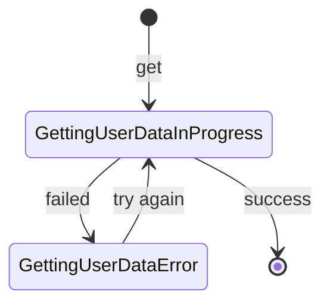

# Состояния

* Не авторизован
* Авторизован
  * Проходит турнир
  * Прошел турнир, отправка результатов
  * Результаты

```mermaid
stateDiagram-v2
  [*] --> Не_авторизован
  Не_авторизован --> Авторизован: авторизоваться
  Авторизован --> Проходит_турнир
  Проходит_турнир --> Проходит_турнир: пройти
  Проходит_турнир --> Прошел_турнир
  Прошел_турнир --> Общие_результаты: отправить результаты
  Общие_результаты --> [*]
```

```mermaid
stateDiagram-v2
  [*] --> CodeExchangeInProgress: exchange code
  CodeExchangeInProgress --> CodeExchangeError: failed
  CodeExchangeError --> CodeExchangeInProgress: try again
  CodeExchangeInProgress --> [*]: success
```

```mermaid
stateDiagram-v2
  [*] --> GettingUserDataInProgress: get
  GettingUserDataInProgress --> GettingUserDataError: failed
  GettingUserDataError --> GettingUserDataInProgress: try again
  GettingUserDataInProgress --> [*]: success
```
